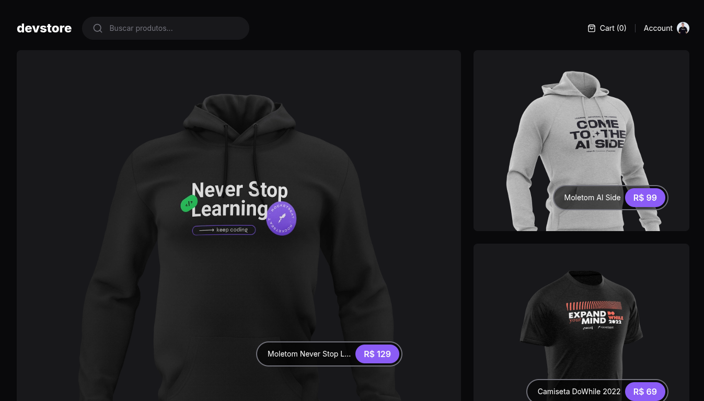

# DevStore


Projeto de e-commerce utilizando o Next.js com o Server Components. O projeto tem funcionalidades como listagem de produtos, carrinho de compras e busca.

## Sobre o projeto
O projeto simula um carrinho de compras e possui as seguintes funcionalidades:

- [x] Listagem de produtos
- [x] Exibir detalhes dos produtos
- [x] Adicionar produtos ao carrinho
- [x] Buscar por produtos

## Tecnologias utilizadas

[](https://react.dev/)
[](https://reactrouter.com/)
[](https://www.cypress.io/)
[](https://nextjs.org/)
[](https://tailwindcss.com/)

## 🎨 Layout

Você pode acessar o layout da aplicação pelo seguinte link:

- [Layout](https://www.figma.com/design/IxFEeERjLiZe1b8fv4OxaQ/devstore-%E2%80%A2-Projeto-React-(Community)?node-id=0-1&t=B32koNDjeEYflsx5-1)

Lembrando que é necessário possuir uma conta no [Figma](https://www.figma.com/).

## 🚀 Como executar a aplicação

A aplicação está disponível online e pode ser acessada por esse [link](https://coffeedeliveryproject.netlify.app/).

Caso queira executar a aplicação em seu local, siga os seguintes passos:

- Clone esse repositório:

```
git clone https://github.com/andersondev96/next13-devstore
```

- Para rodar o servidor será necessário clonar esse repositório:

```
git clone https://github.com/rocketseat-education/ignite-devstore-api
```

**No servidor:**

- Acesse a aplicação:
```
cd ignite-devstore-api
```
- Instale as dependências:
```
npm install
```
ou
```
pnpm install
```
- Rode o servidor na porta ``3000``:
```
npm run dev
```
ou
```
pnpm run dev
```

**Na aplicação:**

- Acesse a aplicação

```
cd next13-devstore
```

- Instale as dependências
```
npm install
```
ou
```
pnpm install
```
- Clone o .env.example e renomeie para .env
```
cp .env.example .env
```

> Como o servidor já está rodando na porta 3000, a aplicação deverá rodar na porta 3001.

- Para executar a aplicação, execute os comandos:
```
npm run dev
```
ou
```
pnpm run dev
```

- Abra a aplicação no navegador de sua preferência.

 ## 🤝 Como contribuir?

- Faça um fork desse repositório.
- Crie uma branch com a sua feature: `git checkout -b my-feature`.
- Faça commit das suas alterações: `git commit -m 'feat: My new feature'`.
- Faça push para a sua branch: `git push origin my-feature`.

Depois que o merge da sua pull request for feito, você pode deletar a sua branch.

## 📝 Licença

Este projeto está sob a licença [MIT](LICENSE).

## 👥 Autor


**Anderson Fernandes Ferreira**

[](https://instagram.com/anderson_ff13)
[](mailto:andersonfferreira96@gmail.com.br)
[](https://www.linkedin.com/in/anderson-fernandes96/)

Feito com 💚 por Anderson Fernandes 👋 [Entre em contato!](https://www.linkedin.com/in/anderson-fernandes96/)


